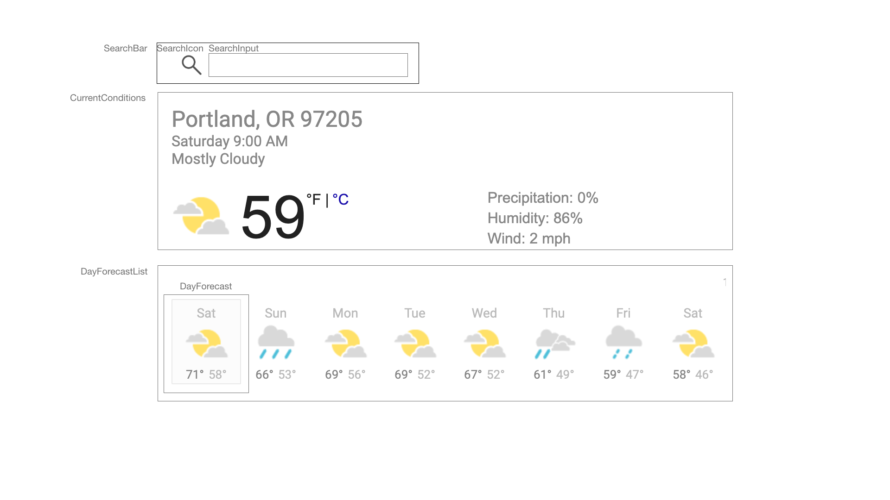
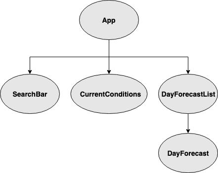

# Weather App

## Project Description

### Project’s Purpose or Goal:
Display a weather forecast for a location imputed by the user

### Absolute minimum features the project requires to meet this purpose or goal:

A user will be able to enter a location (city and state or zipcode) and see:
* The current weather conditions, containing:
 * Location
 * Time of last update
 * Summary of conditions
 * Icon corresponding to conditions (sun for sunny/clear, clouds for cloudy, etc.)
 * Change of precipitation percentage
 * Humidity percentage
 * Windspeed in miles per hour
* A 7-day forecast, containing for each day:
  * Day of the week
  * Icon for the weather
  * High/Low temperatures

A user will be able to click on any day in the 7-day forecast and the current conditions will display will change to show corresponding details for the selected day.

A user will be able to click an update/refresh button to update the current conditions and

### What tools, frameworks, libraries, APIs, modules and/or other resources (whatever is specific to your track, and your language) will you use to create this MVP? List them all here. Be specific.

* React
* Weather API

### If you finish developing the minimum viable product (MVP) with time to spare, what will you work on next? Describe these features here: Be specific.

* Display an hourly forecast in tabular form
* Display an hourly temperature graph
* Display sunrise, sunset, first light, and last light times
* Display a radar/weather map for the given location
* Display historical weather info for the given location (either detailed over time or average high/low for the given day over the last few years)
* User authentication and ability to save locations for each user

### What additional tools, frameworks, libraries, APIs, or other resources will these additional features require?

* Possible a second API for historical weather data
* Google maps + location APIs?
* Maybe a ruby+rails backend to store historical weather data in a database?
* Some kind of graphics library for graphing temperature over time

### Visual Mockup

### Component Tree Diagram

### State Slices

* location:
 * description (String)
 * latitude (Number)
 * longitude (Number)

* currentConditions:
  * time (String)
  * summary (String)
  * iconName (String)
  * temp (Number)
  * precipitation (Number)
  * humidity (Number)
  * windspeed (Number)

* dayForecastData, array with 7 objects, each having attributes:
 * dayOfWeek (String)
 * iconName (String)
 * highTemp (Number)
 * lowTemp (Number)
 * summary (String)
 * temp (Number)
 * precipitation (Number)
 * humidity (Number)
 * windspeed (Number)

* selectedDayIndex (Number)

### Determining where state will live

SearchBar needs to set _location_, _currentConditions_, and _dayForecastData_.

CurrentConditions needs access to _location_, _currentConditions_, _selectedDayIndex_, and _dayForecastData_

DayForecastList needs access to _dayForecastData_ and needs to be able to set _selectedDayIndex_

RefreshButton (TODO) needs to be able to set _currentConditions_ and _dayForecastData_.

This project was bootstrapped with [Create React App](https://github.com/facebook/create-react-app).

## Available Scripts

In the project directory, you can run:

### `npm start`

Runs the app in the development mode. 
Open [http://localhost:3000](http://localhost:3000) to view it in the browser.

The page will reload if you make edits. 
You will also see any lint errors in the console.

### `npm test`

Launches the test runner in the interactive watch mode. 
See the section about [running tests](https://facebook.github.io/create-react-app/docs/running-tests) for more information.

### `npm run build`

Builds the app for production to the `build` folder. 
It correctly bundles React in production mode and optimizes the build for the best performance.

The build is minified and the filenames include the hashes. 
Your app is ready to be deployed!

See the section about [deployment](https://facebook.github.io/create-react-app/docs/deployment) for more information.

### `npm run eject`

**Note: this is a one-way operation. Once you `eject`, you can’t go back!**

If you aren’t satisfied with the build tool and configuration choices, you can `eject` at any time. This command will remove the single build dependency from your project.

Instead, it will copy all the configuration files and the transitive dependencies (Webpack, Babel, ESLint, etc) right into your project so you have full control over them. All of the commands except `eject` will still work, but they will point to the copied scripts so you can tweak them. At this point you’re on your own.

You don’t have to ever use `eject`. The curated feature set is suitable for small and middle deployments, and you shouldn’t feel obligated to use this feature. However we understand that this tool wouldn’t be useful if you couldn’t customize it when you are ready for it.

## Learn More

You can learn more in the [Create React App documentation](https://facebook.github.io/create-react-app/docs/getting-started).

To learn React, check out the [React documentation](https://reactjs.org/).

### Code Splitting

This section has moved here: https://facebook.github.io/create-react-app/docs/code-splitting

### Analyzing the Bundle Size

This section has moved here: https://facebook.github.io/create-react-app/docs/analyzing-the-bundle-size

### Making a Progressive Web App

This section has moved here: https://facebook.github.io/create-react-app/docs/making-a-progressive-web-app

### Advanced Configuration

This section has moved here: https://facebook.github.io/create-react-app/docs/advanced-configuration

### Deployment

This section has moved here: https://facebook.github.io/create-react-app/docs/deployment

### `npm run build` fails to minify

This section has moved here: https://facebook.github.io/create-react-app/docs/troubleshooting#npm-run-build-fails-to-minify
